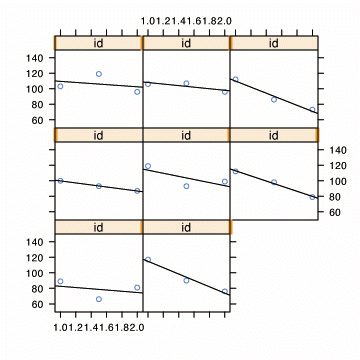
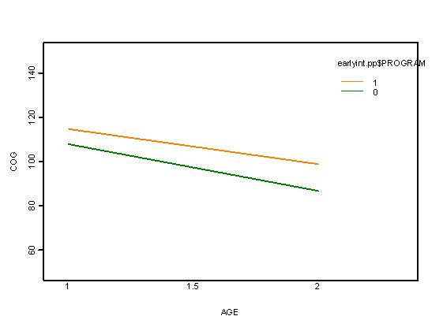

<https://stats.idre.ucla.edu/r/examples/alda/>

```{r setup, include=FALSE}
knitr::opts_chunk$set(echo = TRUE, collapse = FALSE, eval=FALSE)

library(lattice)
library(latticeExtra)
library(grid)
library(plotrix)
library(tidyverse)

```

```{r function-defs, include=FALSE}
# inspired by: https://stackoverflow.com/questions/35627075/r-lattice-multiple-plot-page-how-to-put-text-in-page-margin
suptitle <- function(title, cex=1.5) {
  require(grid, quietly=T)
  vp<-viewport(x=0.5,y=1,width=1,height=0.05, just=c('center','top'))
  pushViewport(vp)
  grid.text(title,gp=gpar(cex=cex))
  popViewport()
}
```


## Chapter 3

The data are not publicly available, so it's not possible to recreate the chapter.
Instead, results taken from idre website, and code shown for illustration.

```{r load data}
early.int <- read.table("d:/earlyint_pp.txt", header=T, sep=",")
early.int <- early.int %>% mutate(id = factor(id))
attach(early.int)
```

## Empirical Change Plots

```{r plot}
subset <- early.int[c(1:12, 175:186)]
subset

with(subset,
     xyplot( cog ~ age | id, data = subset, as.table=T,ylim=c(50,150),type=c("p","r"))
)

```

```{r}
   obs  id age cog program
1    1  68 1.0 103       1
2    2  68 1.5 119       1
3    3  68 2.0  96       1
4    4  70 1.0 106       1
5    5  70 1.5 107       1
6    6  70 2.0  96       1
7    7  71 1.0 112       1
8    8  71 1.5  86       1
9    9  71 2.0  73       1
10  10  72 1.0 100       1
11  11  72 1.5  93       1
12  12  72 2.0  87       1
13 175 902 1.0 119       0
14 176 902 1.5  93       0
15 177 902 2.0  99       0
16 178 904 1.0 112       0
17 179 904 1.5  98       0
18 180 904 2.0  79       0
19 181 906 1.0  89       0
20 182 906 1.5  66       0
21 183 906 2.0  81       0
22 184 908 1.0 117       0
23 185 908 1.5  90       0
24 186 908 2.0  76       0
```



## Mixed effect model fitting

### Formulation

#### Level 1

$$OUTCOME_{ij} = \pi_{0i} + \pi_{1i} * TIME_{ij} + \epsilon_{ij}
\\
\epsilon_{ij} \sim N(0, \sigma_\epsilon^2)$$


#### Level 2

$$\pi_{0i} = \gamma_{00} + \gamma_{01} * CONDITION_i + \zeta_{0i}
\\
\pi_{1i} = \gamma_{10} + \gamma_{11} * CONDITION_i + \zeta_{1i}$$


$$\begin{bmatrix}
\zeta_{0i} \\ \zeta_{1i}
\end{bmatrix}
\sim \mathcal{N}
\left(
\begin{bmatrix}
  0 \\ 0
\end{bmatrix},
\begin{bmatrix}
  \sigma_{0}^2 & \sigma_{01} \\ \sigma_{10} & \sigma_{1}^2
\end{bmatrix}
\right)$$

```{r}
library(nlme)

model1<- lme(cog ~ time * program, data=early.int, random= ~time | id, method="ML")
summary(model1)
       
```

### Result

```{r}
       AIC      BIC    logLik 
  2385.942 2415.809 -1184.971

Random effects:
 Formula:  ~ time | id
 Structure: General positive-definite
               StdDev   Corr 
(Intercept) 11.135975 (Inter
       time  3.187612 -0.997
   Residual  8.644657       

Fixed effects: cog ~ time * program 
                 Value Std.Error  DF   t-value p-value 
 (Intercept)  107.8407  2.047915 204  52.65879  <.0001
        time  -21.1333  1.895694 204 -11.14807  <.0001
     program    6.8547  2.729082 101   2.51171  0.0136
time:program    5.2713  2.526229 204   2.08661  0.0382

Standardized Within-Group Residuals:
       Min         Q1        Med        Q3      Max 
 -2.347486 -0.5673839 0.02896275 0.5661698 2.330276

Number of Observations: 309
Number of Groups: 103
```

### Interpretation


### Plotting Fits
```{r fits}
a <- fitted.values(model1)
interaction.plot(age, program, a, xlab="AGE", ylab="COG", 
                 ylim=c(50, 150), lwd=4, lty=1, col=4:5)

```


